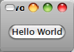

.. _02start:
.. vim: ts=4

2. Getting Started
==================

2.1. Hello World in PyGTK
-------------------------

先來一個最簡單的PyGTK程式

.. literalinclude:: examples/base.py
    :language: python
    :linenos:

    Figure 2.1 Base.py

再來，多加一些按鈕、和其他東西
HelloPyGTK

.. literalinclude:: examples/helloworld.py
    :language: python
    :linenos:

    Figure 2.2 Hellworld.py

和上面的Base.py相比，這個新版的helloWorld多用到了::
  
  False
  gtk.mainquit()
  gtk.Window()
  gtk.Button()

2.2. Theory of Signals and Callbacks
------------------------------------

.. note::
   在GTK 2.0 single system已經移到GLib，這邊不會太深入介紹。

GTK+ 是依事件驅動(:term:`event driven`)設計的， gtk.main()會維持sleep的狀態，直有事件生、再把權轉移對應的function。當事件生，被按下的widget會送某些signal，程式就以就對應的動作處理。例如按下按鈕，按鈕送 ``pressed`` 之類的signal，程式就印出一段文字。

要讓按鈕作出動作，我們要把對應的 signal 和合適的function連 起來。用的 是 ``GtkWidget`` (from ``GObject`` class) method

.. function:: handler_id = object.connect(name, func, func_data)

   將元件的signal和對應的callback函式連接

   :param name: widget發出的signal的名字，例:destory, closed,pressed
   :param func: 對應的function,例：self.on_pressed()
   :param func_data: 要傳送給func的資料，例：leave_massage
   :rtype: handler_id 

如果callback function是個 object method，則看起來會像是這樣

.. function:: def func(self, widget, callback_data)

    對應的callback 函數

    :param self: self pointer
    :param widget: 發出signald 的 widget
    :param callback_data: 前面的func_data

2.3. Events
-----------

除了signal 外，另外還有 event來對應 Xwindow的 X event，callback一樣可以用在這些event上。::

    event
    button_press_event
    button_release_event
    scroll_event
    motion_notify_event
    delete_event
    destroy_event
    expose_event
    key_press_event
    key_release_event
    enter_notify_event
    leave_notify_event
    configure_event
    focus_in_event
    focus_out_event
    map_event
    unmap_event
    property_notify_event
    selection_clear_event
    selection_request_event
    selection_notify_event
    proximity_in_event
    proximity_out_event
    visibility_notify_event
    client_event
    no_expose_event
    window_state_event

使用方式一樣是用 connect(),
::
    def callback_func(widget, event, callback_data ):
    def callback_meth(self, widget, event, callback_data ):

 ``GdkEvent`` 是python object，它的屬性可以指出哪些事件已發生。下面列出一些例子。::

    NOTHING
    DELETE
    DESTROY
    EXPOSE
    MOTION_NOTIFY
    BUTTON_PRESS
    _2BUTTON_PRESS
    _3BUTTON_PRESS
    BUTTON_RELEASE
    KEY_PRESS
    KEY_RELEASE
    ENTER_NOTIFY
    LEAVE_NOTIFY
    FOCUS_CHANGE
    CONFIGURE
    MAP
    UNMAP
    PROPERTY_NOTIFY
    SELECTION_CLEAR
    SELECTION_REQUEST
    SELECTION_NOTIFY
    PROXIMITY_IN
    PROXIMITY_OUT
    DRAG_ENTER
    DRAG_LEAVE
    DRAG_MOTION
    DRAG_STATUS
    DROP_START
    DROP_FINISHED
    CLIENT_EVENT
    VISIBILITY_NOTIFY
    NO_EXPOSE
    SCROLL
    WINDOW_STATE
    SETTING

這些值可以在 ``gtk.gdk`` 找到。例： ``gtk.gdk.DRAG_ENTER`` 。
所以把這些event和 callback function連接起來的用法
::
  button.connect("button_press_event", button_press_callback)

function的回傳值可以了解event被GTK+處理的情形。例如：回傳值是
    * TRUE，表示event被正確的處理，不必再把enent傳出去。
    * FALSE，表示要繼續event 處理的流程。

再舉個例子：event: "application close"
    * TRUE，關掉程式，不用再等待其他event
    * FALSE，繼續等待其他event發生

GDK的選擇、拖放 API會送出一連串的signal，以表示發生的事件

::

    selection_received
    selection_get
    drag_begin_event
    drag_end_event
    drag_data_delete
    drag_motion
    drag_drop
    drag_data_get
    drag_data_received

.. seealso::

    * :doc:`Chapter 20, Advanced Event and Signal Handling <20advSignal>`
    
    * :doc:`22dragdrop`
      * Section 22.3.2, “Signals On the Source Widget”
      * Section 22.3.4, “Signals On the Destination Widget”

2.4. Stepping Through Hello World
---------------------------------

Hello World詳解

(略)

