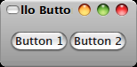

.. _03moveon:

3. Moving On
===============

3.1. More on Signal Handlers
-----------------------------

connect()的回傳值是一個整數。每個signal、或每個object的callback function可以有很多個。callback function被呼叫的的順序，是以依它們之前被連接時的先後順序來決定。

有connect()，當然也就有disconnect()::

    object.disconnect(id)

也可以暫時讓signal失效::
    
    object.signal_handler_block(handler_id)
    
    object.signal_handler_unblock(handler_id)

3.2. An Upgraded Hello World
-----------------------------

Hello World Mark II 加強版

.. include:: examples/helloworld2.py
    :literal:

   Figure 3.1. Upgraded Hello World Example

.. vim: ts=4
