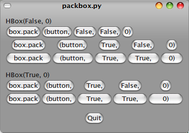
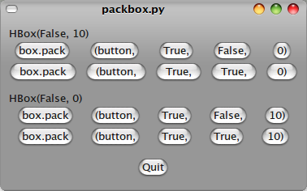
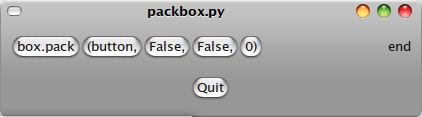
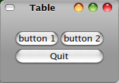

.. _04packing:

4. Packing Widgets
===================

當你想要放更多的widgets的時候，如何把widgets放你想要的位置？

4.1. Theory of Packing Boxes
-----------------------------

大多數widgets的排版工作都是透過box來完成的。box看不到，
不過對我們的元件排列重要。

 * Box有兩種: Hbox(), Vbox() 
 * 打包的方法有兩種: pack_start(), pack_end()

+--------------+----------+-----------+
|              |Vbox()    |  Hbox()   |
+--------------+----------+-----------+
| pack_start() |由上到下  |  由左到右 |
+--------------+----------+-----------+
| pack_end()   |由下到上  |  由右到左 |
+--------------+----------+-----------+

4.2. Details of Boxes
-----------------------

因為GTK+ boxes的使用很有彈性、有很多選項，但不是所有的更動可以從介面上看出來, boxes是怎麼組合在一起的。所以可能初學者剛開始會混淆。run packbox.py之後，會出現 Figure 4.1, “Packing: Five Variations”  的圖，可以看到Boxes有五種不同的排列。

   Figure 4.1, “Packing: Five Variations”

每一行有一個Hbox、內含數個buttons，都是用pack_start() 包裝的。

pack_start()的例子::

    box.pack_start(child, expand, fill, padding)

Property:
 * box: 是用來包裝的容器
 * child: 是要裝到容器中的widgets
 * expand: 參數:第一個button，到最後一個button間的距離是否會隨window放大而增加
 * fill: 參數: button是否隨著距離加大而改變大小
 * padding: 參數:button間的間距

Python可以在function,method設預設參數。整份教學的function都會預設參數，之後再呼叫到這個function的時候，就不必每個參數都例出來，例::

    box.pack_start(child, expand=True, fill=True, padding=0)
    
    box.pack_end(child, expand=True, fill=True, padding=0)

expand, fill, padding 如果不設定，程式就會自己採用預設值。所以只要指定child就好了。

之後再新建 box的時候::

    hbox = gtk.HBox(homogeneous=False, spacing=0)
    
    vbox = gtk.VBox(homogeneous=False, spacing=0)

homogeneous 可以讓box中的每個widget都有一樣的大小(例: Hbox中等寬，Vbox中等高)
如果這個參數被打開了，之前就會一直預設為TRUE。

這兩個有什麼不同？

 * spacing (新建box時設定):只會在widgets間生效
 * padding (widgets被包進來時設定):會在widgets兩邊生效

   Figure 4.2, “Packing with Spacing and Padding”

圖中的其他buttons都是用pack_start() packing的，而end 用pack_end()，所以會
一直靠在最右邊。

   Figure 4.3, “Packing with pack_end()”

4.3. Packing Demonstration Program
-------------------------------------

packbox.py

.. include:: examples/packbox.py
    :literal:

4.4. Packing Using Tables
----------------------------

試試另一種排版方式：Table
在某些情形下，用Table排版是很有用的。用Table畫格子，所以可以控制所有元件有同樣的大小。
先來試試  gtk.Table()::
    
    table = gtk.Table(rows=1, columns=1, homogeneous=False)

Property:
 * rows 行
 * columns 列
 * homogeneous TRUE:所有的widgets會設成同樣大小

行列的設定是從 0 開始::

    0          1          2
    0+----------+----------+
     |          |          |
    1+----------+----------+
     |          |          |
    2+----------+----------+

Table的排列是從左上方開始，要包widgets的話，用::

    table.attach(child, left_attach, right_attach, top_attach, bottom_attach,
               xoptions=EXPAND|FILL, yoptions=EXPAND|FILL, xpadding=0, ypadding=0)

Property:
 * child: 要包進的widgets
 * left_attach,right_attach,top_attach,bottom_attach:指widgets靠的方向，還有要用多少boxes，例：
  - 一個button佔滿2x2 table的右下區::
    left_attach = 1, right_attach = 2, top_attach = 1, bottom_attach = 2
    
  - 一個button佔滿整個2x2 talbe上半區::
    left_attach = 0, right_attach = 2, top_attach = 0, bottom_attach = 1
 * xoptions=EXPAND|FILL ,yoptions=EXPAND|FILL:
  - FILL:如果table cell比widget大，widget填滿整個cell
  - SHRINK:如果table widget所得到的空間比指定的小，widgets會隨window縮小
  - EXPAND:table會著window大
 * xpadding=0, ypadding=0:在widgets間形成一圈空間

set_row_spacing() , set_col_spacing() 可以在整行整列間加空間::

    table.set_row_spacing(row, spacing)
    table.set_col_spacing(column, spacing)

行多出的空間會在下方，列出的空間會在右方。

也可以一口氣設所有的行列::

    table.set_row_spacings(spacing)
    table.set_col_spacings(spacing)

不過這個設定對最後的行列沒有效果

4.5. Table Packing Example
---------------------------

範例：table.py 2x2 talbe中有3個buttons

   Figure 4.4. Packing using a Table

.. include:: examples/table.py
    :literal:

.. vim: ts=4
