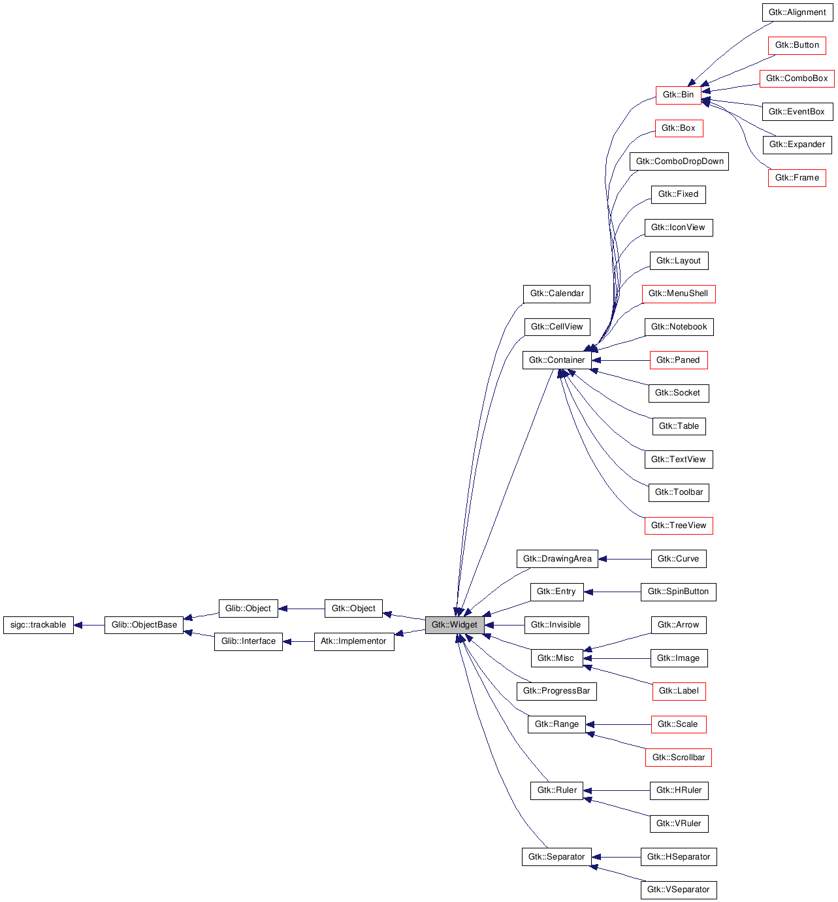
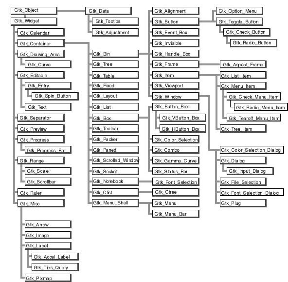

.. _05widget:

5. Widget Overview
==================

一般來說使用PyGTK widgets的步驟:
 * import gtk.* 的modules
 * 把signals、event和合適的function連接
 * 設定widgets的屬性
 * 用gtk.Container.add(),或gtk.box.pack_start()把widgets包裝起來
 * gtk.Widget.show()

show()讓GTK知道這個widgets已經準備好了。你也可以用gtk.Widget.hide() 把widget 隱藏。哪個widgets先show並不重要，不過建議是把主要的window最後show出來，這樣可以一次show出所有widgets，而不是一塊一塊打散的widgets跑出來。子元件要在父元件show出來之後，才會出現。

5.1. Widget Hierarchy
---------------------

GTK Widget 家族繼承圖

* `Graphviz版`

* `Another`

* Text 版
.. include:: images/GTKhierarchy.txt
    :literal:

5.2. Widgets Without Windows
----------------------------

這些widgets不屬window下的widges，如果你想用這些元件發出的event，用 Event Box ，見 section EventBox widget. ::

  gtk.Alignment
  gtk.Arrow
  gtk.Bin
  gtk.Box
  gtk.Button
  gtk.CheckButton
  gtk.Fixed
  gtk.Image
  gtk.Label
  gtk.MenuItem
  gtk.Notebook
  gtk.Paned
  gtk.RadioButton
  gtk.Range
  gtk.ScrolledWindow
  gtk.Separator
  gtk.Table
  gtk.Toolbar
  gtk.AspectFrame
  gtk.Frame
  gtk.VBox
  gtk.HBox
  gtk.VSeparator
  gtk.HSeparator

.. seealso::
    * Chapter 20, Advanced Event and Signal Handling

.. vim: ts=4

