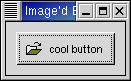

.. _06button:
.. vim:set shiftwidth=4 tabstop=4 expandtab textwidth=79:

.. module:: button
    :synopsis: Button widgets

6. The Button Widget
=====================

.. class:: Normal buttons

6.1. Normal Buttons
--------------------

button widget是滿基本的的widget。你可以用gtk.Button()建立一個簡單的button，button上的文字或圖形，可以留空白、用字串設定。也可以用box把 label或是pixmap 放上去。

建立button::

    button = gtk.Button(label=None, stock=None)

Property:    
 * `label`: 就是button上的文字 
 * `stock`: button上的圖形或是label

::

  STOCK_DIALOG_INFO
  STOCK_DIALOG_WARNING
  STOCK_DIALOG_ERROR
  STOCK_DIALOG_QUESTION
  STOCK_DND
  STOCK_DND_MULTIPLE
  STOCK_ADD
  STOCK_APPLY
  STOCK_BOLD
  STOCK_CANCEL
  STOCK_CDROM
  STOCK_CLEAR
  STOCK_CLOSE
  STOCK_CONVERT
  STOCK_COPY
  STOCK_CUT
  STOCK_DELETE
  STOCK_EXECUTE
  STOCK_FIND
  STOCK_FIND_AND_REPLACE
  STOCK_FLOPPY
  STOCK_GOTO_BOTTOM
  STOCK_GOTO_FIRST
  STOCK_GOTO_LAST
  STOCK_GOTO_TOP
  STOCK_GO_BACK
  STOCK_GO_DOWN
  STOCK_GO_FORWARD
  STOCK_GO_UP
  STOCK_HELP
  STOCK_HOME
  STOCK_INDEX
  STOCK_ITALIC
  STOCK_JUMP_TO
  STOCK_JUSTIFY_CENTER
  STOCK_JUSTIFY_FILL
  STOCK_JUSTIFY_LEFT
  STOCK_JUSTIFY_RIGHT
  STOCK_MISSING_IMAGE
  STOCK_NEW
  STOCK_NO
  STOCK_OK
  STOCK_OPEN
  STOCK_PASTE
  STOCK_PREFERENCES
  STOCK_PRINT
  STOCK_PRINT_PREVIEW
  STOCK_PROPERTIES
  STOCK_QUIT
  STOCK_REDO
  STOCK_REFRESH
  STOCK_REMOVE
  STOCK_REVERT_TO_SAVED
  STOCK_SAVE
  STOCK_SAVE_AS
  STOCK_SELECT_COLOR
  STOCK_SELECT_FONT
  STOCK_SORT_ASCENDING
  STOCK_SORT_DESCENDING
  STOCK_SPELL_CHECK
  STOCK_STOP
  STOCK_STRIKETHROUGH
  STOCK_UNDELETE
  STOCK_UNDERLINE
  STOCK_UNDO
  STOCK_YES
  STOCK_ZOOM_100
  STOCK_ZOOM_FIT
  STOCK_ZOOM_IN
  STOCK_ZOOM_OUT

`buttons.py`_ 這個程式是button使用icon和label的簡單範例
來，之後可以再利用

.. _`button.py`: examples/buttons.py

   Figure 6.1, “Button with Pixmap and Label”

.. include:: examples/buttons.py
   :literal:

``xpm_label_box()`` 可以把xpm或label放到任何可以當容器的widgets裡。

Button widget有這些signal::

    pressed - emitted when pointer button is pressed within Button widget

    released - emitted when pointer button is released within Button widget

    clicked - emitted when pointer button is pressed and then released within Button widget

    enter - emitted when pointer enters Button widget

    leave - emitted when pointer leaves Button widget

.. class:: Toggle buttons

6.2. Toggle Buttons
-------------------

Toggle button(切換按鈕)和一的button最大的不同是，它會一保持有狀態：開或關。

toggle button基本上不少特性都是從check,radio button繼承來的。

新建一個toggle button::

    toggle_button = gtk.ToggleButton(label=None)

基本特性和button差不多，toggle button上的label的文字如果有 "_"的字元，的出現
快速鍵存取的功能。

要存取widgets(toggle,check,radio)的狀態的話，呼叫 ``get_active()`` 。
應應的signal是 "toggled"，對應的callback函數::

  def toggle_button_callback(widget, data):
      if widget.get_active():
          # If control reaches here, the toggle button is down
      else:
          # If control reaches here, the toggle button is up

另：          
 * 要改變toggle button的狀態，
    可以用 ``is_active``
    - down,depressed: is_active,TRUE
    - up,released: FALSE
    - 預設 FALSE::

    toggle_button.set_active(is_active) 
            
 * 當使用 ``set_active()`` 的時候，widgets會送出"clicked","toggled"::

    toggle_button.get_active()

這個method的傳回值是TRUE,FALSE

    Figure 6.2. Toggle Button Example    

.. include:: examples/togglebutton.py
    :literal:

.. class:: Check buttons

6.3. Check Buttons
------------------

check buttons(選取按鈕) ：多選

    Figure 6.3. Check Button Example

.. include:: examples/checkbutton.py
    :literal:

.. class:: Radio buttons

6.4. Radio Buttons
-------------------

Radio buttons(單選按鈕) 最大的不同是通常會有多個選項，不過同時只能選擇一個。
在多選一的情形下，通常就會用到 gtk.RadioButton()。

新增 radio button::

    radio_button = gtk.RadioButton(group=None, label=None)

radio button多了 ``group`` 這個參數是用來指定要和之前建立的radio button成為同
個群組。所以第一個建立的radio button的 ``group`` 應該會是``None``

    Figure 6.4. Radio Buttons Example

.. include:: examples/radiobuttons.py
    :literal:

.. seealso::

