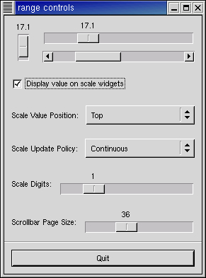

.. _08range:
.. vim:set shiftwidth=4 tabstop=4 expandtab textwidth=79:

.. module:: range
    :synopsis: Range 用來改變大小的元件

8. Range Widgets
================

這節介紹的都是可以改變大小的widget,ex:scrollbar. 它們有著類似的功能、相似的元素
。它們都有 trough (槽，兩波峰間低處) ，slider (有時也稱thumbwhell)。

在 :doc:`07adjustments` 提到的，我們可以使用 Adjustments 來連接各 range widgets的狀態。

8.1. Scrollbar Widgets
-----------------------

Scrollbar，通常用來捲動 list, text bar,viewport之類的元件。其他用途,可以用
scale widgets，功能比較多。

分HSscrollbar, VSscrollbar兩種。
::

    hscrollbar = gtk.HSscrollbar(adjustment=None)

    vscrollbar = gtk.VSscrollbar(adjustment=None)

``adjustment`` 參數可以指向一個 ``Adjustment`` 元件，或None。

8.2. Scale Widgets
-------------------

Scale Widgets 可以讓使用者在一段數值間選擇。可以用來縮放圖片，或調整亮度…。

8.2.1. Creating a Scale Widget
~~~~~~~~~~~~~~~~~~~~~~~~~~~~~~~

就像Scrollbar，scale widgets也有水平，垂直兩種。工作原理相同。例::

    vscale = gtk.VScale(adjustment=None)

    hscale = gtk.HScale(adjustment=None)

``adjustment`` 可以指定一個 ``Adjustment`` 或是 None.  為了.為了不要混
淆， 你可以自己新建一個有page_size= 0.0的 Adjustment , 所以 upper值就可以和選擇
的數值對應。

8.2.2. Methods and Signals (well, methods, at least)
~~~~~~~~~~~~~~~~~~~~~~~~~~~~~~~~~~~~~~~~~~~~~~~~~~~~~~

Scale widgets可以數字顯示目前數值，預設值是顯示。
::

    scale.set_draw_value(draw_value)

draw_value : TRUE | FALSE

scale widgets的顯示值會自動取到小數點之後一位，可以用這個式子改變值::

    scale.set_digits(digits)

digits 是相顯示的值。可以設定任何值，不過顯示在螢幕上的最大只會有13位數字。

最後，值可以設定在相對於 trough 上的位置，在水平scale widget的左方、右方。在
垂直scale widget的上方、下方::

  scale.set_value_pos(pos)

參數可以是::

  POS_LEFT
  POS_RIGHT
  POS_TOP
  POS_BOTTOM

8.3. Common Range Methods
----------------------------

Range widget class 內部原理很複雜。但是只有在想去改寫元件內部的時候，才會有這種
感覺。

而且，幾乎所有定義的methods, signals都作用於互動事件上。也就是在Range
widgets只有少數共通的methods。

8.3.1. Setting the Update Policy
~~~~~~~~~~~~~~~~~~~~~~~~~~~~~~~~~~

range widgets的 update policy是用來定義何時改變admustment的資料，何時送出
"value_changed" signal給 Adjustment。例：

``UPDATE_CONTINUOUS``
    這是預設值。"value_changed"會一直送出。例：slider 只有位置有任何變化就會送出
signal。

``UPDATE_DISCONTINUOUS``    
    只在slider停止移動，AND 放開滑鼠按鍵的時候，會送出signal。

``UPDATE_DELAYED``
    slider停止移動， OR 放開滑鼠按鍵後一段時間後，會送出signal。

.. method:: range.set_update_policy(policy)
設定 update policy::

  range.set_update_policy(policy)

8.3.2. Getting and Setting Adjustment
~~~~~~~~~~~~~~~~~~~~~~~~~~~~~~~~~~~~~~~~

指定Adjustment::

  adjustment = range.get_adjustment()

  range.set_adjustment(adjustment)

get_adjustment() 傳回一個Adjustment的 reference

set_adjustment()  將一個Adjustment指定給給這個元件。
    如果這個range已使用這個 Adjustment的話，什麼事也不會發生。
    如果是一個新的Adjustment，它會把舊的Adjustment解除參考，參考到新的
    Adjustment，並動新計算slider的大小位置、並重繪。

在 :ref:`07adjustments` 有提過，如果你想使用舊的Adjustment。當你直接改變
Adjustment的值，你需要手動送出 "changed" signal::

  adjustment.emit("changed")

8.4. Key and Mouse Bindings
----------------------------

大部分的GTK+元件對滑鼠動作的反應都很類似。

在trough上按左鍵(button 1) ->  ``page_increment`` + or -
在trough上按右鍵(button 2) -> slider會直接跳到游標的位置

在scrollbar的箭頭上按左鍵，或右鍵，``step_increment`` + or -

Scrollbars不能取得焦點(not focusable)，所以沒有key bindings。
其他元件的key bindings在水平、垂直range widgets間有些不同。

所有的 range widgets可以用方向鍵、和 Page UP , Page Down控制。
    箭頭:``step_increment``
    Page UP(Down): ``page_increment``

使用者也可以用Home,End直接把slider從一段移到另一端。

8.5. Range Widget Example
----------------------------

範例程式 (:file:`rangewidgets.py`) 中，一個視窗中有三個range widgets，全部連接
到同一個Adjustment，另有些元件用來控制上一節提到的一些參數，你可以動手試試看
這些不同的參數對元件的影響。

    Figure 8.1. Range Widgets Example

.. include:: examples/rangewidgets.py
    :literal:

你可能注意到程式沒有呼叫 :meth:`connect()`來連接 ``delete_event`` 卻是叫了
``destory`` signals。 結果相同，因為``delete_event`` 一樣會把 ``destory``
signals 送給視窗。

.. seealso::

