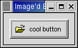

.. _09misc: 
.. vim:set shiftwidth=4 tabstop=4 expandtab:

.. module:: misc
    :synopsis: Miscellaneous Widgets

Chapter 9. Miscellaneous Widgets
=============================

9.1. Labels
----------

Labels 是很常用的元件。Labels不會送出signal，和X window沒有連結。所以如果
需要Labels能對事件作出反應的話，像是：剪貼，可以把Labels放到 ``EvenBox``
(see :doc:`10container` ) 或是一個按鈕裡 (see :doc:`06button` )

新增 labels::

    label = gtk.Label(str)

str就是Label上的顯示的文字，要改變文字的話::

    label.set_text(str)
    
Label所需要的空間會隨上面的文字長度而自動改變，有換行符號的話，也會跟著換行。

取得Label上的文字::

    str = label.get_text()

Label上的文字排列設定::

    label.set_justify(jtype)

``jtype`` 的值有::

    TIFY_LEFT # 預設值
    JUSTIFY_RIGHT
    JUSTIFY_CENTER
    JUSTIFY_FILL # does not work

9.3. The Tooltips Object
-----------------------

9.4. Progress Bars
-----------------

9.5. Dialogs
------------

9.6. Images
-------------

9.6.1. Pixmaps
~~~~~~~~~~~~~~~~~~~

9.7. Rulers
-----------

9.8. Statusbars
---------------

9.9. Text Entries
------------------

9.10. Spin Buttons
-----------------

9.11. Combo Widget
-----------------

9.12. Calendar
--------------

9.13. Color Selection
-------------------------

9.14. File Selections
-------------------------

9.15. Font Selection Dialog
--------------------------

* a bullet point using "*"

  - a sub-list using "-"

    + yet another sub-list

  - another item

Section 1.2 Title
-----------------

.. literalinclude:: example/example.py
    :language: python
    :linenos:

.. image:: images/helloworld.png

   Figure 6.1, “Button with Pixmap and Label”

.. class:: Normal buttons

.. function:: format_exception(etype, value, tb[, limit=None])

   Format the exception with a traceback.

   :param etype: exception type
   :param value: exception value
   :param tb: traceback object
   :param limit: maximum number of stack frames to show
   :type limit: integer or None
   :rtype: list of strings

.. seealso::

    `zlib <http://docs.python.org/library/zlib.html>`_
            The standard library documentation for this module.

    :mod:`gzip`
            The gzip module interface to the zlib library.

    http://www.zlib.net/
            Home page for zlib library.

